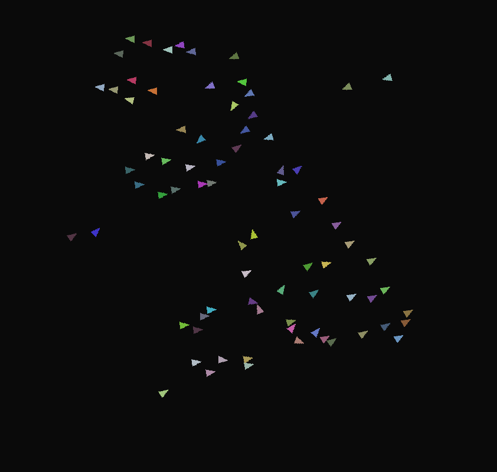

# PyNBoids
### A recreation of the Boids simulation

This is my attempt at recreating the [Boids simulation](https://en.wikipedia.org/wiki/Boids "Wikipedia"), written in Python3 with Pygame2.

Preview:

Screenshot:

